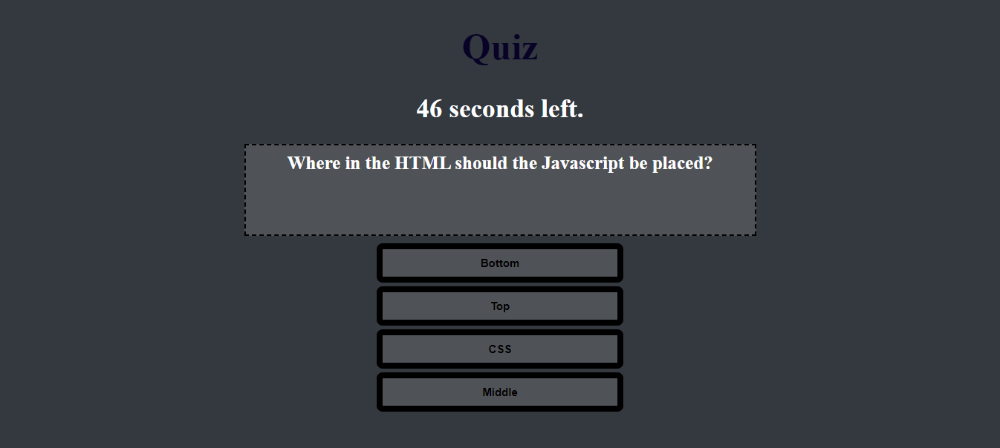

# Javascript Quiz

This code quiz focuses on the Javacript fundamentals that we have learned the last couple of weeks.  The quiz begins when the user hits the start button and the 60second timer begins to count down and the first appears.  When the button corresponding to the correct answer is clicked, the next question is presented and a point is added to the score.  When a wrong answer is selected, the timer deducts 5 seconds and the user is given the chance to try again.  The quiz is over once the timer runs to 0 or all the questions are answered.  Once the quiz is complete, a prompt asks for the user's initials that are then stored in local storage along with their score. The quiz has been deployed at [kellyjohnson364.github.io/code-quiz](https://kellyjohnson364.github.io/code-quiz).  

Email: KJ3641402@gmail.com
Linkedin: linkedin.com/in/KellyJohnson364
